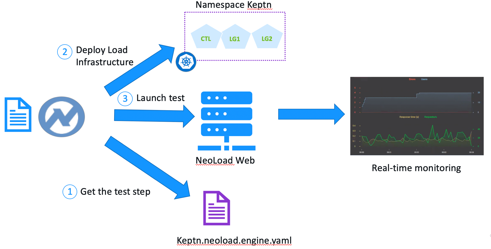

# Neoload Setup

The [Keptn Neoload service](https://github.com/keptn-contrib/neoload-service) sets up dynamic Neoload
generators in the cluster that are invoked as the testing strategy instead if the Keptn default of Jmeter.

Here is diagram of the setup where the tests are managed by NeoLoad web and can monitored there in real-time.



You will need to do a few things to be setup for testing with NeoLoad.

1. To disable the jmeter-service by deleting its distributor by running this command
    ```
    kubectl -n keptn delete deployment jmeter-service-deployment-distributor
    ```
1. Within NeoLoad
    * Have a a [Neoload Web](https://neoload.saas.neotys.com) account.
    * Generate an [API token](https://www.neotys.com/documents/doc/nlweb/latest/en/html/#24270.htm)
    * Create NeoLoad Web [Managed Zone for the Load Testing INfrastructure used by Keptn](https://www.neotys.com/documents/doc/nlweb/latest/en/html/#27521.htm#o39043)

1. Deploy NeoLoad Keptn service
    ```
    cd ~
    git clone --branch 0.6.0 https://github.com/keptn-contrib/neoload-service --single-branch

    cd ~/neoload-service/installer/
    
    # this will prompt for your NeoLoad url, token, zone
    ./defineNeoLoadWebCredentials.sh

    # install the Keptn service using your entered information
    ./deployNeoLoadWeb.sh
    ```
        
1. Use the ```keptn add-resource``` command to add the Neoload test scripts

    ```
    cd ~/keptn-onboarding/frontend/neoload/staging
    keptn add-resource --project=keptnorders --service=frontend --stage=staging --resource=keptn.neoload.engine.yaml --resourceUri=keptn.neoload.engine.yaml
    cd ~/keptn-onboarding/frontend/neoload/production
    keptn add-resource --project=keptnorders --service=frontend --stage=production --resource=keptn.neoload.engine.yaml --resourceUri=keptn.neoload.engine.yaml

    cd ~/keptn-onboarding/order/neoload/staging
    keptn add-resource --project=keptnorders --service=order --stage=staging --resource=keptn.neoload.engine.yaml --resourceUri=keptn.neoload.engine.yaml
    cd ~/keptn-onboarding/order/neoload/production
    keptn add-resource --project=keptnorders --service=order --stage=production --resource=keptn.neoload.engine.yaml --resourceUri=keptn.neoload.engine.yaml

    cd ~/keptn-onboarding/customer/neoload/staging
    keptn add-resource --project=keptnorders --service=customer --stage=staging --resource=keptn.neoload.engine.yaml --resourceUri=keptn.neoload.engine.yaml
    cd ~/keptn-onboarding/customer/neoload/production
    keptn add-resource --project=keptnorders --service=customer --stage=production --resource=keptn.neoload.engine.yaml --resourceUri=keptn.neoload.engine.yaml

    cd ~/keptn-onboarding/catalog/neoload/staging
    keptn add-resource --project=keptnorders --service=catalog --stage=staging --resource=keptn.neoload.engine.yaml --resourceUri=keptn.neoload.engine.yaml
    cd ~/keptn-onboarding/catalog/neoload/production
    keptn add-resource --project=keptnorders --service=catalog --stage=production --resource=keptn.neoload.engine.yaml --resourceUri=keptn.neoload.engine.yaml
    ```
